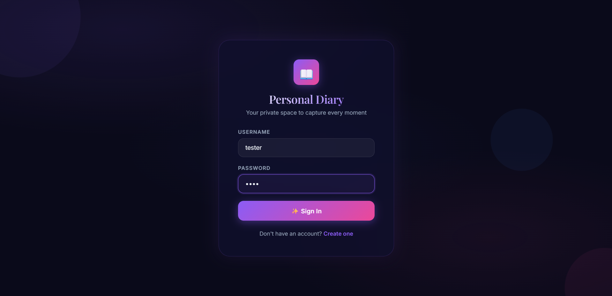
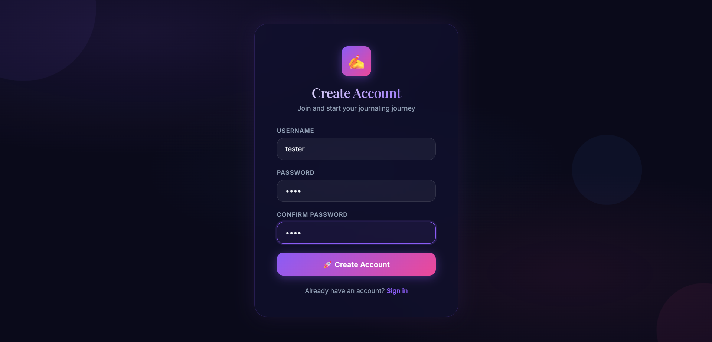
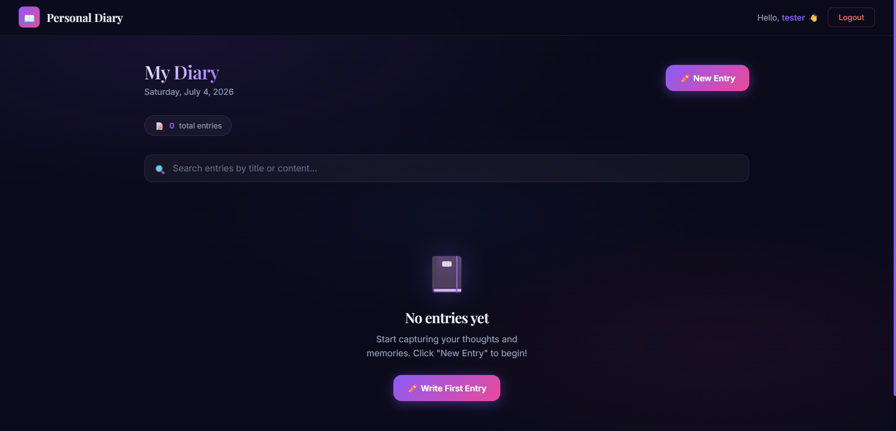
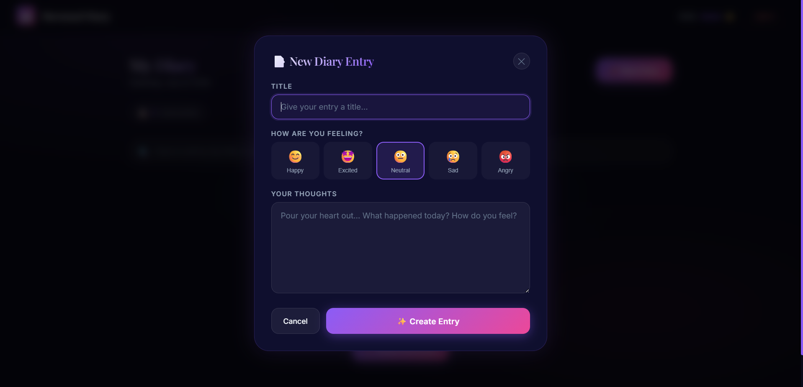

# 📖 Personal Diary

A modern and secure **Personal Diary Web Application** that allows users to record their daily thoughts, emotions, and memories in a beautiful dark-themed interface.

> Capture your moments. Express your feelings. Keep your memories private.

---

## 🌟 Features

- 🔐 User Authentication
  - Create a new account
  - Secure Sign In
  - Logout functionality

- 📝 Diary Management
  - Create diary entries
  - Add a title to every entry
  - Write detailed thoughts and experiences

- 😊 Mood Tracking
  - Happy 😀
  - Excited 🤩
  - Neutral 😐
  - Sad 😢
  - Angry 😡

- 🔍 Search Functionality
  - Search diary entries by title or content

- 📅 Dashboard
  - Displays current date
  - Shows total diary entries
  - Clean and minimal interface

- 🎨 Modern UI
  - Beautiful Dark Theme
  - Responsive Design
  - Glassmorphism inspired interface
  - Smooth animations
  - Gradient buttons
  - User-friendly experience

---

## 🛠️ Tech Stack

### Frontend
- HTML5
- CSS3
- JavaScript

### Backend
- Node.js
- Express.js

### Database
- Local JSON Storage

---

# 📸 Screenshots

## 🔐 Sign In



---

## 📝 Create Account



---

## 📖 Dashboard



---

## ✨ Create New Diary Entry



---

# 🚀 Installation

## 1. Clone the Repository

```bash
git clone https://github.com/yourusername/personal-diary.git
```

## 2. Open Project

```bash
cd personal-diary
```

## 3. Install Backend Dependencies

```bash
cd backend
npm install
```

## 4. Start Backend Server

```bash
node server.js
```

## 5. Open another Terminal

```bash
cd frontend
npm install
npm run dev
```

Open your browser and visit:

```
http://localhost:5173
```

---

# 📂 Project Structure

```
personal-diary/
│
├── backend/
│   ├── server.js
│   ├── routes/
│   ├── data/
│   └── package.json
│
├── frontend/
│   ├── src/
│   ├── public/
│   ├── package.json
│   └── vite.config.js
│
├── screenshots/
│   ├── signin_page.png
│   ├── create_account.png
│   ├── personal_diary.png
│   └── create_personal_diary.png
│
└── README.md
```

---

# 🎯 Future Improvements

- 📅 Calendar View
- 🏷️ Tags & Categories
- ❤️ Favorite Entries
- 📷 Image Upload
- 🌙 Multiple Themes
- ☁️ Cloud Database Integration
- 📱 Progressive Web App (PWA)
- 🔒 Password Encryption
- 📊 Mood Analytics
- 📤 Export Diary as PDF

---

# 💡 Why This Project?

This project was built to provide users with a secure and elegant digital diary experience. It combines authentication, mood tracking, diary management, and a modern UI to create a simple yet powerful journaling application.

---

# 🤝 Contributing

Contributions are welcome!

1. Fork the repository
2. Create your feature branch
3. Commit your changes
4. Push to your branch
5. Open a Pull Request

---

# 📄 License

This project is licensed under the MIT License.

---

## ⭐ Support

If you like this project, don't forget to **⭐ Star** the repository on GitHub!
