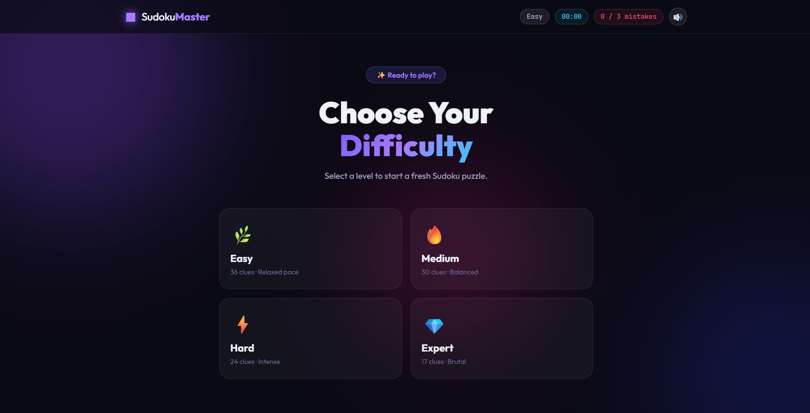
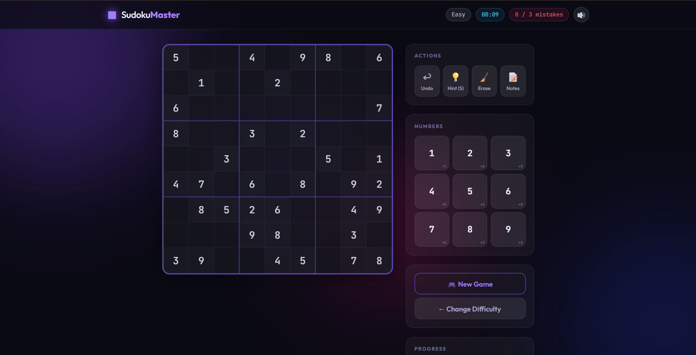
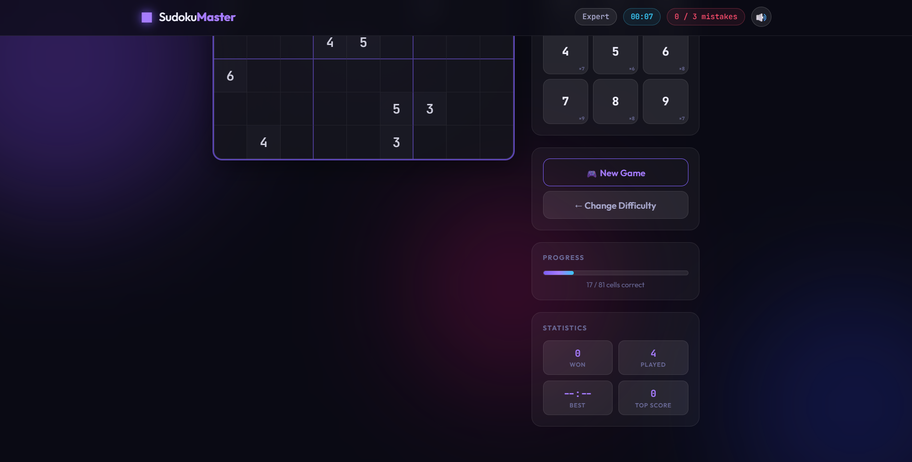

# Build_With_Udymai_Fullstack_Development
# 🎮 Sudoku-Master

A modern and interactive Sudoku game built using **HTML**, **CSS**, and **JavaScript**. SudokuMaster offers a beautiful dark-themed interface, multiple difficulty levels, real-time game statistics, and an engaging user experience for Sudoku enthusiasts.

## 🌐 Live Demo

🔗 https://sudokumaster-gamma.vercel.app/

---

# 📖 About the Project

SudokuMaster is a browser-based Sudoku puzzle game that combines elegant UI design with interactive gameplay. Players can choose from multiple difficulty levels and solve randomly generated Sudoku puzzles while tracking their progress through a built-in timer, mistake counter, and game statistics.

The project was developed to strengthen front-end development skills, focusing on DOM manipulation, responsive design, JavaScript game logic, and clean user experience.

---

# ✨ Features

- **🎯 Interactive 9×9 Sudoku Board**: Fluid layout using CSS Grid and Flexbox with ambient blur lighting and hover animations.
- **🌿 Dynamic Puzzle Generator**: Dynamically generates unique Sudoku puzzles per level:
  - **Easy** (36 clues)
  - **Medium** (30 clues)
  - **Hard** (24 clues)
  - **Expert** (17 clues)
- **⏱️ Real-time Game Timer & Mistakes**: 3 mistakes limit with auto-validation for a challenging experience.
- **💡 Smart Hint System**: Instantly reveals correct cell numbers.
- **↩️ Multi-Step Undo**: Full game action history stack to reverse moves and notes.
- **📝 Pencil Notes Mode**: Add candidate numbers to cells with automatic note cleanup when matching numbers are placed in intersecting rows/columns/boxes.
- **🧹 Erase & Clean**: Instantly clear values and notes.
- **📈 Local Stats & Scores**: Persists personal best times, high scores, and games played/won in the browser (`localStorage`).
- **🔊 Web Audio API Synthesizer**: Immersive audio effects generated in real-time (no heavy audio files to load). Sound can be toggled on/off.
- **🌙 Modern Glassmorphism UI**: High-contrast dark mode aesthetics utilizing deep hues, purples, and responsive layouts.

---

# 🛠️ Technologies Used

- HTML5
- CSS3
- JavaScript (ES6)
- Git & GitHub
- Vercel

---

# 📸 Screenshots

## 🏠 Home Screen

Choose your preferred difficulty before starting the game.



---

## 🎲 Gameplay

Interactive Sudoku board with hints, notes, timer, and number pad.



---

## 📊 Progress & Statistics

Track your progress, completed cells, games played, and overall performance.



---

# 🎮 How to Play

1. Select your preferred difficulty.
2. Click on an empty cell.
3. Choose a number between **1–9**.
4. Fill every row, column, and 3×3 box without repeating numbers.
5. Use hints, notes, erase, or undo whenever needed.
6. Complete the puzzle before reaching the mistake limit.

---

# 🎹 Keyboard Shortcuts

Boost your efficiency with keyboard-only controls:

| Key / Shortcut | Action |
|---|---|
| **Arrow Keys** | Move cell selection up, down, left, or right |
| **1 - 9** | Place number (or pencil mark in Notes mode) |
| **Delete / Backspace / 0 / Escape** | Erase/deselect the selected cell |
| **N / n** | Toggle **Notes Mode** |
| **H / h** | Request a **Hint** |
| **Ctrl + Z / Cmd + Z** | **Undo** last move |

---

# 📂 Project Structure

```
SudokuMaster/
│
├── index.html
├── style.css
├── sudoku.js
├── README.md
└── screenshots/
```

---

# 🚀 Installation

Clone the repository

```bash
git clone https://github.com/manishverma29/Sudoku-Game.git
```

Open the project folder

```bash
cd Sudoku-Game
```

Run the project by opening **index.html** in your browser.

---

# 💡 Future Improvements

- Dark/Light Theme Toggle
- Online Leaderboard & Global Leaderboards
- Daily Sudoku Challenges
- Save & Resume Game State
- Achievement System
- Multiplayer Mode

---

# 👨‍💻 Author

**Manish Verma**

- GitHub: https://github.com/manishverma29
- Live Demo: https://sudoku-game-beta-steel.vercel.app/

---

## ⭐ If you like this project, consider giving it a star on GitHub!
